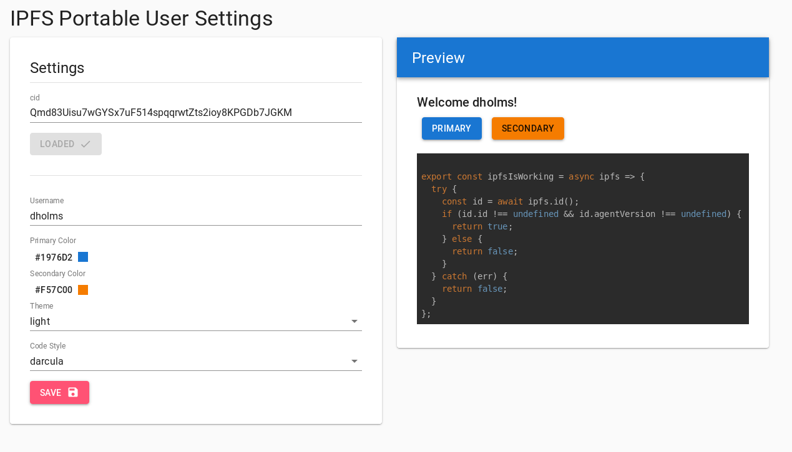

# IPFS-backed Portable User Settings

[](https://github.com/fission-suite/blob/master/LICENSE)
[](https://codeclimate.com/github/fission-suite/ipfs-user-settings/maintainability)
[](https://fission.codes)
[](https://discord.gg/zAQBDEq)

A front end application to demonstrate portable user settings through IPFS. Change your preferences once and take them with you wherever you go.

### Check out the [live demo](https://fission-suite.github.io/ipfs-user-settings/) and our [forum post](https://talk.fission.codes/t/ipfs-user-settings-app/235) for a more in-depth walkthrough.



## Get started
- Install dependencies: `npm i`
- Dev mode: `npm run start`
- Prod build: `npm run build`
- Deploy to Github pages: `npm run deploy`
  - Before deploying, change `homepage` in `package.json` to the url you will deploy to (ie: `$YOUR_USERNAME.github.io/ipfs-user-settings`).

## Environment
```
REACT_APP_DEFAULT_CID = QmUWWqCNSdZmus7mc52um5cpqUi1CaE97AzBTY7iWfBXV9
REACT_APP_BOOTSTRAP_NODE_TCP = /ip4/3.215.160.238/tcp/4001/ipfs/QmVLEz2SxoNiFnuyLpbXsH6SvjPTrHNMU88vCQZyhgBzgw
REACT_APP_BOOTSTRAP_NODE_WSS = /dns4/ipfs.runfission.com/tcp/4003/wss/ipfs/QmVLEz2SxoNiFnuyLpbXsH6SvjPTrHNMU88vCQZyhgBzgw
REACT_APP_INTERPLANETARY_FISSION_URL = https://runfission.com
REACT_APP_INTERPLANETARY_FISSION_USERNAME = ADD_USERNAME_HERE
REACT_APP_INTERPLANETARY_FISSION_PASSWORD = ADD_PASSWORD_HERE
```

`REACT_APP_DEFAULT_CID`: the cid that contains the default settings that you want a new user to see. You can set it to the above value for our recommended defaults (or leave it blank and it will default to that).

`REACT_APP_BOOTSTRAP_NODE_TCP`: the multiaddr of the ipfs node that you would like the user's node to connect to through tcp (for instance with a local daemon through ipfs companion). You can set it to the above value to connect to the IPFS node that Fission hosts (or leave it blank and it will default to that). 

`REACT_APP_BOOTSTRAP_NODE_WSS`: the multiaddr of the ipfs node that you would like the user's node to connect to through wss (if the user does not have an ipfs-enabled browser and falls back to an in-browser js-ipfs daemon). You can set it to the above value to connect to the IPFS node that Fission hosts (or leave it blank and it will default to that). **Note:** if you use a custom node, it must be interoperable with `js-ipfs`. This means that it either needs to connect via WebRTC or Secured Websockets (notice the `wss` in the above multiaddr).

`REACT_APP_INTERPLANETARY_FISSION_...`: the last three variables are your provisioned account information for using the Fission web-api. These are used for pinning content to the Fission IPFS node so that content will stay online even after a user goes offline. If you leave them blank, the webapp will not pin user content. At the moment, these can be obtained by joining the [Fission Heroku add-on alpha](https://elements.heroku.com/addons/interplanetary-fission).


